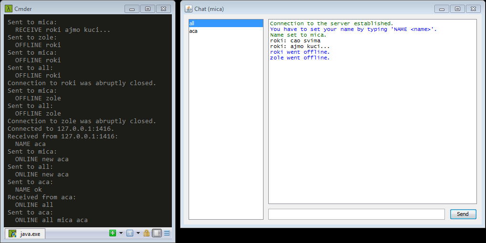

# NetChat

Domaći iz računarskih mreža. Prosta klijent-server čet aplikacija u Javi.



## Korišćenje

Najlakše je izbildovati iz [IntelliJ IDEA](https://www.jetbrains.com/idea/download/) (**Build | Build Artifacts**).

Serveru se broj porta može proslediti kao argument komandne linije, a podrazumevani je 8818.

```bash
java -jar Server.jar <port_number>
```

## Poruke

Server takoreći služi kao middleman između klijenata. 

### Klijent → Server

* `QUIT`
* `ONLINE all`
* `NAME <my_name>`
* `SEND [all|<recipient_name>] <message>`

### Server → Klijent
* `NAME [ok|taken]`
* `ERROR recipient`
* `OFFLINE <client_name>`
* `ONLINE new <new_client_name>`
* `ONLINE all <all_client_names>`
* `RECEIVE <sender_name> <message>`

## Tutorijali

[Internet Programming with Java Course](https://www.nakov.com/inetjava/lectures/part-1-sockets/InetJava-1.4-TCP-Sockets.html)

[Java Network Programming - Multi-User Chat Application](https://www.youtube.com/playlist?list=PLdmXYkPMWIgCocLY-B4SvpQshQWC7Nc0C)